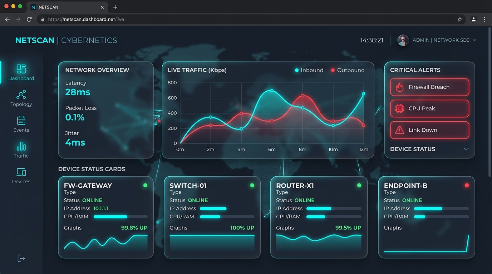

# 🌐 NetPulse - Telemetría de Red en Tiempo Real



NetPulse es un motor de monitoreo de red ultra rápido escrito en **Go**, que integra un hermoso dashboard web reactivo construido con **React y Framer Motion**. Diseñado para descubrir dispositivos en tu red local (LAN) automáticamente, evaluar su latencia en milisegundos y presentarlo en un panel premium incrustado dentro de un único archivo ejecutable (`.exe`).

## ✨ Características Principales

*   **⚡ Motor Concurrente (Go):** Arquitectura robusta utilizando `Goroutines`, `Channels` con buffer, y `sync.WaitGroup`. Capaz de monitorear cientos de dispositivos simultáneamente sin cuellos de botella.
*   **🔍 Auto-Descubrimiento en Vivo (ARP Sweep):** Utiliza la API nativa de Windows (`SendARP`) a nivel de Capa 2 para descubrir dispositivos ocultos o con firewall cerrado (PlayStation, Smart TVs, teléfonos). Escanea la red de fondo cada 60 segundos buscando equipos nuevos.
*   **📡 Telemetría TCP Estricta:** Implementa timeouts controlados a nivel de Go usando `select` y canales para evitar bloqueos del Kernel de Windows. Configurable hasta la precisión de milisegundos (`200ms`).
*   **🎨 Dashboard Premium (React + Tailwind v4):** 
    *   Interfaz con estilo Glassmorphism, animaciones impulsadas por Framer Motion.
    *   Sparklines SVG (gráficas de latencia en vivo).
    *   Fondo animado (Particle Canvas) basado en nodos conectados.
*   **🚀 Cero Dependencias Externas:** El build completo de React se comprime e incrusta directamente dentro de `netpulse.exe` utilizando `go:embed`. No requieres Node.js ni Apache/Nginx para ejecutarlo.
*   **📱 Notificaciones (Opcional):** Integración nativa para disparar alertas a Telegram o Webhooks cuando un equipo se cae.

## ⚙️ Arquitectura del Sistema

El proyecto está diseñado bajo un modelo de concurrencia comunicante, siguiendo el proverbio: *"No comuniques compartiendo memoria; comparte memoria comunicándote."*

1.  **Engine (`internal/pinger`):** Lee `targets.json` de forma segura (con `sync.RWMutex`), lanza una Goroutine por cada IP, ejecuta el ping (ARP o TCP), recolecta los resultados a través de canales y retorna el reporte del ciclo completo.
2.  **Discovery (`internal/discovery`):** Funciona como una sub-rutina de fondo. Escanea la subred `/24` utilizando semáforos (límite de 64 hilos) para no saturar la tarjeta de red. Los dispositivos nuevos se escriben automáticamente al archivo JSON.
3.  **Hub & Server (`internal/hub` y `internal/server`):** Levantan un servidor HTTP y actualizan de `http` a `ws` (WebSockets). Cada vez que el Engine termina un ciclo (cada 1 segundo por defecto), el servidor inyecta el JSON del ciclo al Hub, el cual lo reparte de forma concurrente a todos los clientes web conectados.
4.  **Frontend (`cmd/netpulse/dashboard`):** Un cliente TypeScript estricto que escucha el WebSocket (`useNetPulse.ts`). Almacena los últimos 20 puntos de latencia en un historial local para dibujar gráficas fluidas sin sobrecargar el servidor Go.

## 🚀 Cómo Ejecutar

Para uso normal con descubrimiento automático y panel web activo:

```powershell
.\Iniciar_NetPulse.bat
```
*(O internamente: `go run ./cmd/netpulse -scan -save -web`)*

Luego, abre tu navegador en: [http://localhost:8080](http://localhost:8080)

## 🛠️ Configuración Extrema (`targets.json`)

El archivo de configuración define los objetivos a monitorear y la agresividad del escaneo. 
Ejemplo de configuración para velocidad en tiempo real:

```json
  "settings": {
    "interval_seconds": 1, 
    "timeout_ms": 200,     
    "max_retries": 1       
  }
```
*Esto significa: Escanea a todos cada 1 segundo. Si alguien tarda más de 200ms en responder en un solo intento, márcalo como CAÍDO inmediatamente.*
