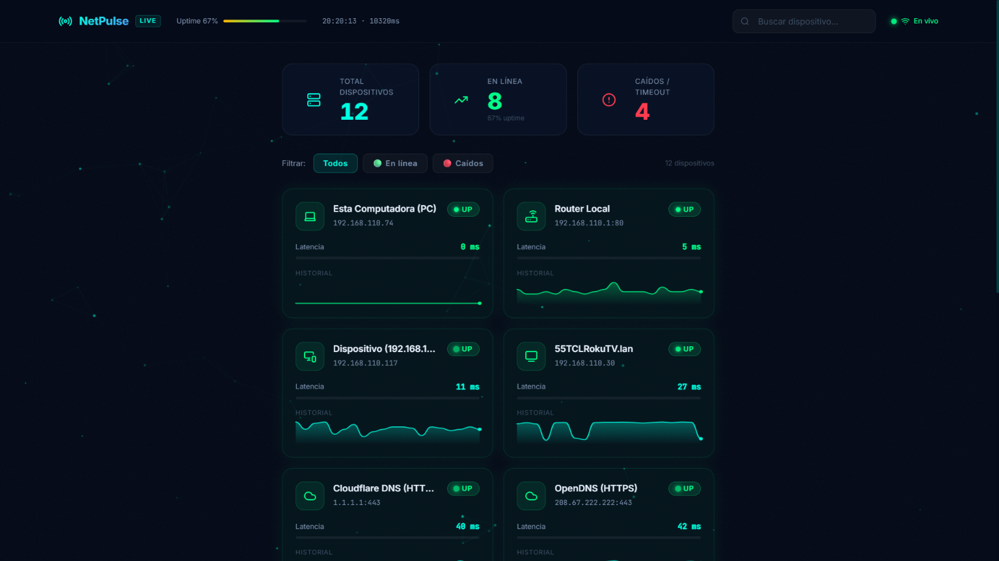
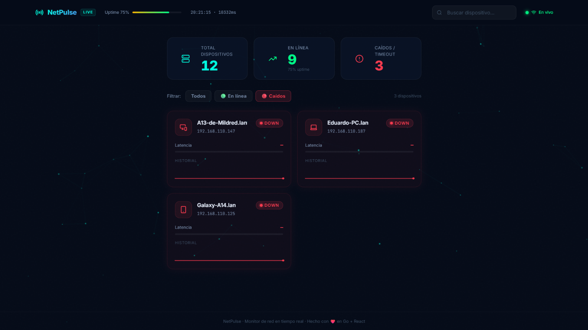

<div align="center">

# 🌐 NETPULSE
### Telemetría de Red en Tiempo Real & Auto-Descubrimiento
**Monitoreo Concurrente, Diagnóstico en Milisegundos y Dashboard Premium**

[](https://github.com/Try2Fun)
[](https://go.dev)
[](https://reactjs.org/)
[](docs/)
[](LICENSE)

<br/>

> **"Un motor concurrente que descubre intrusos y diagnostica la salud de tu red en fracción de segundos, con una interfaz visual de clase mundial."**

<br/>

<p align="center">
  
</p>

[📖 ¿Para qué sirve?](#-para-qué-sirve-y-qué-problema-resuelve) • [⚙️ ¿Cómo funciona?](#-cómo-funciona-la-cadena-de-telemetría) • [🏢 Impacto del Sistema](#-por-qué-esto-destaca-a-nivel-profesional) • [🚀 Inicio Rápido](#-inicio-rápido) • [📊 Dashboard Web](#-dashboard-premium-react)

---

</div>

## 💡 ¿Para qué sirve y qué problema resuelve?

En la gestión moderna de redes, saber qué equipos están conectados y si están funcionando correctamente suele requerir herramientas lentas, pesadas o con interfaces desactualizadas.
- 🐌 **Latencia humana:** Hacer ping manualmente a cada dispositivo y esperar el timeout bloquea el diagnóstico.
- 👻 **Dispositivos Ocultos:** Muchos dispositivos (PlayStation, Laptops corporativas) bloquean los pings normales por firewall, haciéndose invisibles a los escáneres comunes.

### 🎯 La Solución: NetPulse
**NetPulse** es un vigilante de red autónomo que:
1. **Descubre** continuamente nuevos equipos mediante técnicas de bajo nivel que ignoran los firewalls (Capa 2 / ARP).
2. **Diagnostica** cientos de dispositivos al mismo tiempo usando concurrencia extrema en Go, detectando fallos en **milisegundos**.
3. **Visualiza** todo en tiempo real a través de un panel web moderno con animaciones fluidas e indicadores de latencia incrustado en el mismo ejecutable.

---

## ⚙️ ¿Cómo funciona? (La Cadena de Telemetría)

```text
       [ RED LOCAL (LAN) / INTERNET ]
                 │
                 ▼  (Equipos, Servidores, Smart TVs)
     ┌───────────────────────┐
     │   Sondas Concurrentes │  (Go Goroutines & Channels)
     └───────────┬───────────┘
                 │
  [1] MOTOR DE PING ESTRICTO (Timeout controlado en Goroutines)
                 │  -> Pings ARP para redes LAN (Bypass de Firewall)
                 │  -> TCP Dial para redes WAN/Públicas (DNS, Web)
                 ▼
  [2] ESCÁNER DE FONDO INVISIBLE (Auto-Discovery)
                 │  -> Sweep ARP de 254 IPs cada 60s
                 │  -> Bloqueos Mutex para inyección segura en tiempo real
                 ▼
  [3] HUB DE TRANSMISIÓN (WebSockets Thread-Safe)
                 │  -> Empaqueta la telemetría del ciclo en JSON
                 │  -> Dispara broadcast a clientes web conectados
                 ▼
  [4] FRONTEND REACTIVO (Vite + React + Tailwind v4)
                 ├──> Renderizado de Sparklines (gráficas SVG en vivo)
                 ├──> Glassmorphism UI & Framer Motion
                 └──> Cero dependencias: Todo inyectado con go:embed
                 │
                 ▼
  [5] VISUALIZACIÓN EN VIVO (http://localhost:8080)
```

---

## 🏢 ¿Por qué esto destaca a nivel profesional?

Si un reclutador o líder técnico evalúa la arquitectura de este proyecto, encontrará estándares de la industria:

* **⚡ Concurrencia Pura en Go:** Utiliza el modelo CSP (*Communicating Sequential Processes*) con `sync.WaitGroup` y `Channels` bufferizados. Nada de bucles lentos; todo ocurre en paralelo.
* **🛡️ Interacción con el OS:** Llama directamente a la API de Windows (`SendARP` vía `syscall`) y usa aislamientos de hilos para evitar que el Kernel bloquee el programa.
* **🚀 Binario Único (Zero-Config):** Al usar `go:embed`, el cliente no necesita instalar Node.js, NPM ni configurar un servidor web. El archivo `.exe` arranca el backend, levanta el frontend y sirve los WebSockets de forma autónoma.
* **⏱️ Alta Precisión:** Configurado para responder a caídas de red en `200ms`, actualizando la interfaz a velocidades extremas.

---

## 📊 Dashboard Premium (React)

El frontend no es un simple panel de control, es una experiencia de centro de operaciones (*NOC / Cyber-Ops*) con diseño Glassmorphism y telemetría fluida:

#### 🟢 Vista General & Telemetría en Vivo
> Panel principal mostrando el pulso de la red en tiempo real, sparklines vectoriales SVG por dispositivo, métricas de uptime y latencias calculadas en milisegundos.

<p align="center">
  
</p>

#### 🔴 Diagnóstico Inmediato de Nodos Caídos
> Filtro inteligente de incidentes: aísla y resalta al instante equipos inaccesibles (DOWN / Timeout) con alerta visual inmediata para una rápida respuesta.

<p align="center">
  
</p>

### ✨ Aspectos Destacados del Frontend:
- **Dark Mode Avanzado:** Interfaz limpia con tonos oscuros profundos y estética cian/esmeralda.
- **Animaciones Fluidas:** *Framer Motion* gestiona las micro-animaciones al entrar nuevos nodos y variar la latencia.
- **Particle Canvas:** Lienzo dinámico interactivo de fondo que simula los nodos de una red de computadoras.
- **Sparklines Integradas:** Gráficas de comportamiento continuo renderizadas puramente en SVG sin librerías pesadas.
- **Filtros Rápidos:** Segmentación instantánea por estado (*Todos*, *En línea* o *Caídos*).

---

## 🚀 Inicio Rápido

### Ejecutar NetPulse (Windows)

Solo necesitas el archivo ejecutable compilado. No requiere instalaciones complejas.

```bash
# Ejecuta el lanzador automático incluido
.\Iniciar_NetPulse.bat
```
*(El lanzador se encargará de abrir tu navegador automáticamente en `http://localhost:8080` y arrancar el motor con descubrimiento en vivo).*

---

## ⚙️ Configuración Extrema (`targets.json`)

Toda la agresividad del sistema se controla en el archivo JSON. Esta es la configuración recomendada para velocidad y precisión de *milisegundos*:

```json
{
  "settings": {
    "interval_seconds": 1,
    "timeout_ms": 200,
    "max_retries": 1
  }
}
```
* **`interval_seconds: 1`**: La página se refresca cada segundo exacto.
* **`timeout_ms: 200`**: Si un dispositivo tarda más de 200ms en responder, se declara muerto instantáneamente.

---

## 📂 Arquitectura del Directorio

```text
netpulse/
├── cmd/
│   └── netpulse/
│       ├── dashboard/      # Código fuente React (Vite, Tailwind, TypeScript)
│       ├── web/            # Compilado de producción de React incrustado
│       └── main.go         # Punto de entrada de Go (Embed, Web Server, CLI)
├── config/                 # Carga concurrente y RWMutex para targets.json
├── docs/
│   └── img/                # Capturas de pantalla reales en alta resolución
├── internal/
│   ├── discovery/          # Escáner ARP y detección autónoma de hosts
│   ├── hub/                # Manejador WebSocket concurrente para clientes
│   ├── notifier/           # Alertas (Telegram, Webhooks)
│   ├── pinger/             # Motor de telemetría (Engine, Probe, Result)
│   └── server/             # Servidor HTTP y sincronización de estado
├── targets.json            # Base de datos en vivo de los equipos
└── Iniciar_NetPulse.bat    # Lanzador "One-Click"
```

---

## 👨‍💻 Autor y Contribución

Desarrollado con pasión por la telemetría, el alto rendimiento y el diseño moderno por **[Try2Fun](https://github.com/Try2Fun)**.

<div align="center">
  <sub>"La verdadera velocidad de red no se mide en ancho de banda, sino en tiempo de reacción."</sub>
</div>
